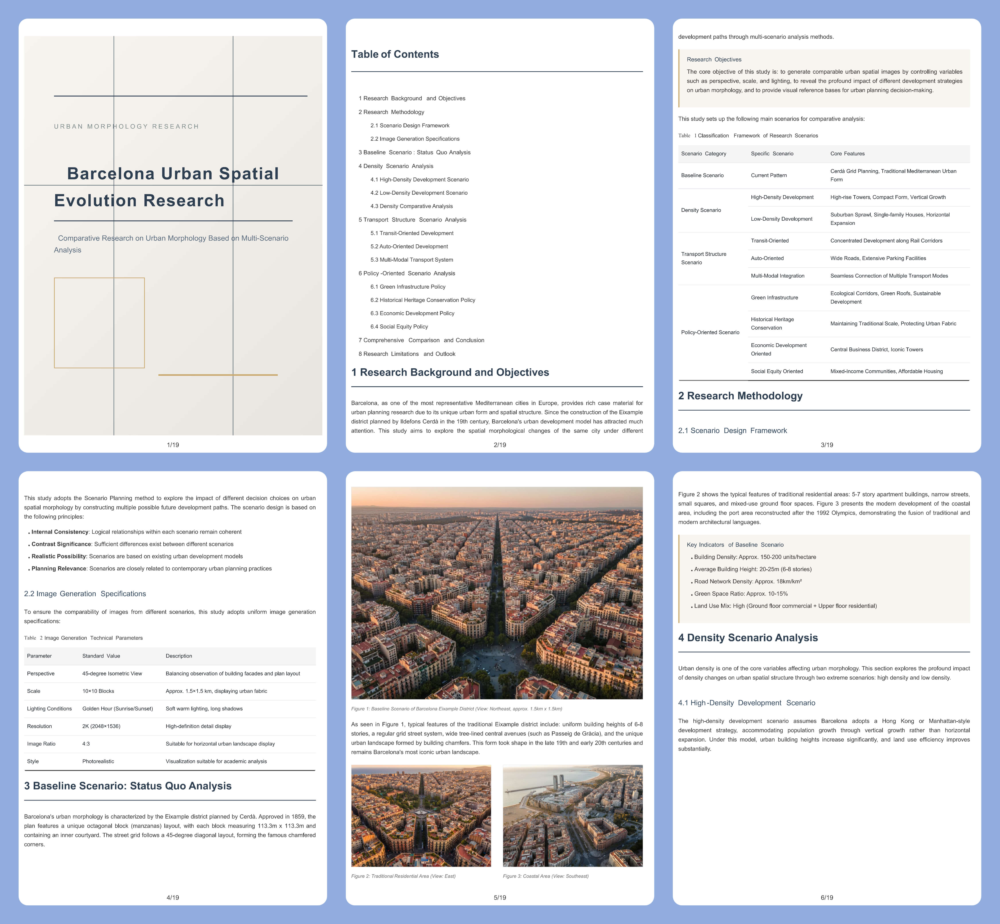

# dompdf.js

[English](./README.md) | [中文](./README_CN.md)

Pure-frontend DOM-to-PDF engine (WASM-backed, no jsPDF). This library allows you to generate editable, non-image, printable vector PDFs directly in the user's browser from web pages or DOM elements. It supports pagination and can generate PDF files with thousands of pages.

**Live Demo:** [Online Demo](https://dompdfjs.lisky.com.cn)

## 🚀 Version Comparison: New vs Old

### New Version (v0.1.0+) - Current
**Technology Stack:** Rust + WebAssembly + TypeScript + Worker
- **Core Engine:** Pure Rust WASM module for PDF generation
- **Architecture:** Main thread collects DOM snapshot → Worker processes → WASM renders PDF
- **Output:** True vector PDF (not image-based)
- **Performance:** Faster rendering, smaller file sizes
- **Features:** Advanced typography, proper text selection, Unicode support

### Old Version (Legacy)
**Technology Stack:** html2canvas + jsPDF + JavaScript
- **Core Engine:** Modified html2canvas canvas-renderer + jsPDF
- **Architecture:** DOM → Canvas image → PDF with embedded images
- **Output:** Image-based PDF (lower quality, larger files)
- **Performance:** Slower due to canvas rendering
- **Features:** Limited text support, basic functionality

### Key Improvements in New Version
| Feature | Old Version | New Version | Benefit |
|---------|------------|-------------|---------|
| **PDF Quality** | Image-based (raster) | Vector-based | Sharper text, smaller files, editable content |
| **Performance** | Canvas rendering bottleneck | WASM optimized | 2-5x faster rendering |
| **File Size** | Large (embedded images) | Compact (vector graphics) | 60-80% smaller PDFs |
| **Text Support** | Basic English fonts | Full Unicode + custom fonts | Proper international text rendering |
| **Architecture** | Monolithic JavaScript | Modular (Worker + WASM) | Better parallelism, non-blocking UI |
| **Memory Usage** | High (canvas buffers) | Optimized (binary snapshots) | Lower memory footprint |

## 📄 PDF Generation Example


## 🛠️ How It Works

This script follows a modern pipeline architecture:

1. **DOM Snapshot Collection** (Main Thread): Walks the DOM tree, computes styles, and captures element geometries
2. **Worker Processing**: Transfers snapshot to a Web Worker for background processing
3. **WASM Rendering**: Rust-compiled WebAssembly module generates PDF bytes
4. **PDF Delivery**: Returns PDF as Blob for download or display

### Advantages
1. **Pure Client-side**: No server-side rendering required
2. **Vector PDFs**: Generates true PDF files, not image-based ones
3. **High Quality**: Editable text, proper typography, scalable graphics
4. **Small File Size**: Vector graphics are compact
5. **Unlimited Pages**: No canvas height limitations
6. **Non-blocking**: Worker-based architecture keeps UI responsive

### Limitations
1. **DOM-based**: May not be 100% pixel-perfect compared to browser rendering
2. **CSS Support**: Some advanced CSS properties may not be fully supported
3. **Complex Layouts**: Very complex nested layouts may have rendering differences

## ✨ Features

| Feature | Status | Description |
|---------|--------|-------------|
| **Pagination** | ✅ | Supports PDF pagination rendering, capable of generating PDF files with thousands of pages |
| **Text Rendering** | ✅ | Supports Unicode text, font families, sizes, styles, colors, line heights, and text alignment |
| **Image Rendering** | ✅ | Supports web images, base64 images, SVG images with proper scaling |
| **Borders** | ✅ | Supports border width, color, style, and radius |
| **Backgrounds** | ✅ | Supports background colors, images, and gradients |
| **Canvas** | ✅ | Supports rendering HTML canvas elements |
| **SVG** | ✅ | Supports rendering SVG elements |
| **Gradients** | ✅ | Supports linear and radial gradients |
| **Custom Fonts** | ✅ | Supports embedding custom TTF/OTF fonts |
| **PDF Encryption** | ✅ | Supports password protection and permission controls |
| **Page Headers/Footers** | ✅ | Configurable headers and footers with dynamic content |
| **Precise Pagination Control** | ✅ | `divisionDisable` and `pageBreak` attributes for layout control |
| **Transparent Backgrounds** | ✅ | Option to generate PDFs with transparent backgrounds |
| **PDF Compression** | ✅ | Optional PDF compression for smaller file sizes |

## 📦 Installation

### NPM
```bash
npm install dompdf.js --save
```

### CDN
```html
<script src="https://cdn.jsdelivr.net/npm/dompdf.js@latest/dist/dompdf.min.js"></script>
```

### Basic Usage
```js
import dompdf from 'dompdf.js';

dompdf(document.querySelector('#capture'), options)
    .then((blob) => {
        const url = URL.createObjectURL(blob);
        const a = document.createElement('a');
        a.href = url;
        a.download = 'example.pdf';
        document.body.appendChild(a);
        a.click();
    })
    .catch((err) => {
        console.error(err);
    });
```

## 📄 PDF Pagination Rendering

By default, dompdf renders the entire document onto a single page. Enable pagination by setting `pagination: true`.

**Important:** Set the DOM node width to match the page width in pixels. For A4 (210mm × 297mm), set width to 794px. See [page sizes reference](./page_sizes.md).

```js
import dompdf from 'dompdf.js';

dompdf(document.querySelector('#capture'), {
    pagination: true,
    format: 'a4',
    pageConfig: {
        header: {
            content: 'Document Header',
            height: 50,
            contentColor: '#333333',
            contentFontSize: 12,
            contentPosition: 'center',
            padding: [0, 0, 0, 0]
        },
        footer: {
            content: 'Page ${currentPage} of ${totalPages}',
            height: 50,
            contentColor: '#333333',
            contentFontSize: 12,
            contentPosition: 'center',
            padding: [0, 0, 0, 0]
        }
    }
}).then((blob) => {
    // Download the PDF
    const url = URL.createObjectURL(blob);
    const a = document.createElement('a');
    a.href = url;
    a.download = 'document.pdf';
    a.click();
});
```

### Precise Pagination Control

#### `divisionDisable` Attribute
Prevent a container from being split across pages:
```html
<div divisionDisable>
    This entire container will move to the next page if it doesn't fit.
</div>
```

#### `pageBreak` Attribute
Force an element to start on a new page:
```html
<div pageBreak>
    This content starts on the next page.
</div>
```

## ⚙️ Options Parameters

| Parameter | Required | Default | Type | Description |
|-----------|----------|---------|------|-------------|
| `useCORS` | No | `false` | `boolean` | Allow cross-origin resources (requires server CORS configuration) |
| `backgroundColor` | No | Auto/White | `string \| null` | Override page background color; pass `null` for transparent background |
| `fontConfig` | No | - | `object \| Array` | Custom font configuration (see below) |
| `encryption` | No | Empty | `object` | PDF encryption: `userPassword`, `ownerPassword`, `userPermissions` |
| `precision` | No | `16` | `number` | Element position precision (higher = more accurate but larger files) |
| `compress` | No | `false` | `boolean` | Enable PDF compression |
| `putOnlyUsedFonts` | No | `false` | `boolean` | Embed only actually used font glyphs |
| `pagination` | No | `false` | `boolean` | Enable pagination rendering |
| `format` | No | `'a4'` | `string` | Page size: `a0-a10`, `b0-b10`, `c0-c10`, `letter`, `legal`, etc. |
| `pageConfig` | No | See below | `object \| Function` | Header/footer configuration |
| `onJspdfReady` | No | - | `Function(jspdf: jsPDF)` | Callback when jsPDF instance is ready |
| `onJspdfFinish` | No | - | `Function(jspdf: jsPDF)` | Callback when PDF generation completes |

### `pageConfig` Fields

| Parameter | Default | Type | Description |
|-----------|---------|------|-------------|
| `header` | See below | `object` | Header settings |
| `footer` | See below | `object` | Footer settings |

### Per-Page Header/Footer Control

`pageConfig` can be a function for per-page control:

```js
pageConfig: (pageNum, totalPages) => {
    // No header/footer on cover page
    if (pageNum === 1) return null;
    // No header/footer on last page
    if (pageNum === totalPages) return null;
    // Normal header/footer on other pages
    return {
        header: {
            content: 'Document Title',
            height: 50,
            contentColor: '#333333',
            contentFontSize: 12,
            contentPosition: 'center'
        },
        footer: {
            content: 'Page ${currentPage} of ${totalPages}',
            height: 50,
            contentColor: '#333333',
            contentFontSize: 12,
            contentPosition: 'center'
        }
    };
}
```

### `pageConfigOptions` Fields

| Parameter | Default | Type | Description |
|-----------|---------|------|-------------|
| `content` | Header: empty<br>Footer: `${currentPage}/${totalPages}` | `string \| Function` | Text content with `${currentPage}` and `${totalPages}` placeholders |
| `height` | `50` | `number` | Region height in pixels |
| `contentPosition` | `'center'` | `string \| [number, number]` | Text position: `center`, `centerLeft`, `centerRight`, etc. or `[x, y]` coordinates |
| `contentColor` | `'#333333'` | `string` | Text color |
| `contentFontSize` | `16` | `number` | Text font size in pixels |
| `padding` | `[0, 24, 0, 24]` | `[number, number, number, number]` | Top/right/bottom/left padding in pixels |

### Font Configuration (`fontConfig`)

| Field | Required | Default | Type | Description |
|-------|----------|---------|------|-------------|
| `fontFamily` | Yes | `''` | `string` | Font family name (must match embedded font) |
| `fontBase64` | Yes | `''` | `string` | TTF font as Base64 string |
| `fontUrl` | No | `''` | `string` | URL to load font from |
| `fontStyle` | Yes | `''` | `string` | `normal` or `italic` |
| `fontWeight` | Yes | `''` | `number` | `400` (normal) or `700` (bold) |
| `iconFont` | No | `false` | `boolean` | Set to `true` for icon fonts |
| `fontBytes` | No | - | `Uint8Array` | Pre-decoded TTF bytes (alternative to fontBase64) |

## 🔣 Font Support & International Text

Since PDFs natively support only basic Latin characters, custom fonts are required for other languages.

### Recommended Chinese Font
Use [Source Han Sans SC](https://github.com/lmn1919/dompdf.js/blob/main/examples/SourceHanSansSC-Normal-Min-normal.js) for Chinese text support.

### Font Conversion
Convert TTF fonts to Base64 using the [font converter](https://github.com/lmn1919/dompdf.js/tree/main/fontconverter).

**Note:** Embedding fonts increases PDF file size. Use font subsetting tools like `Fontmin` to reduce size.

### Example Font Configuration
```js
import dompdf from 'dompdf.js';
import SourceHanSansSC from './SourceHanSansSC-Normal-Min-normal.js';

dompdf(document.querySelector('#capture'), {
    fontConfig: {
        fontFamily: 'SourceHanSansSC-Regular',
        fontBase64: SourceHanSansSC,
        fontStyle: 'normal',
        fontWeight: 400
    }
}).then(blob => {
    // Download PDF
});
```

## 🚀 Advanced Usage

### Multiple Fonts
```js
fontConfig: [
    {
        fontFamily: 'SourceHanSansSC-Regular',
        fontBase64: SourceHanSansSC,
        fontStyle: 'normal',
        fontWeight: 400
    },
    {
        fontFamily: 'SourceHanSansSC-Bold',
        fontBase64: SourceHanSansSCBold,
        fontStyle: 'normal',
        fontWeight: 700
    }
]
```

### PDF Encryption
```js
encryption: {
    userPassword: 'user123',
    ownerPassword: 'owner123',
    userPermissions: ['print', 'copy'] // Optional: 'print', 'modify', 'copy', 'annot-forms'
}
```

### Transparent Background
```js
backgroundColor: null // Generates PDF with transparent background
```

## 🔧 Building from Source

### Prerequisites
- Node.js 18+
- Rust toolchain (for WASM compilation)
- Cargo (Rust package manager)

### Build Commands
```bash
# Install dependencies
npm install

# Build WASM module
npm run build:wasm

# Inline WASM into JavaScript
npm run inline:wasm

# Build the library
npm run build

# Development mode with watch
npm run dev

# Serve examples
npm run serve
```

## 📁 Project Structure

```
dompdf.js/
├── src/                    # TypeScript source code
│   ├── index.ts           # Main entry point
│   ├── snapshot.ts        # DOM snapshot collector
│   ├── format.ts          # Binary format encoder
│   ├── wasm-glue.ts       # WASM integration
│   └── worker.ts          # Web Worker implementation
├── wasm/                  # Rust WASM module
│   ├── src/
│   │   ├── lib.rs        # WASM entry point
│   │   ├── pdf.rs        # PDF generation
│   │   ├── font.rs       # Font handling
│   │   └── snapshot.rs   # Snapshot parsing
│   └── Cargo.toml        # Rust dependencies
├── examples/              # Demo and test files
├── dist/                  # Built output
└── scripts/              # Build and utility scripts
```

## 🤝 Contributing

Contributions are welcome! Please feel free to submit a Pull Request.

1. Fork the repository
2. Create your feature branch (`git checkout -b feature/amazing-feature`)
3. Commit your changes (`git commit -m 'Add some amazing feature'`)
4. Push to the branch (`git push origin feature/amazing-feature`)
5. Open a Pull Request

## 📄 License

This project is licensed under the MIT License - see the [LICENSE](LICENSE) file for details.

## 🙏 Acknowledgments

- Inspired by the original dompdf.js project
- Built with Rust and WebAssembly for performance
- Thanks to all contributors and users

## 📞 Support

- **Issues:** [GitHub Issues](https://github.com/lmn1919/dompdf.js/issues)
- **Documentation:** [Read the docs](./docs/)
- **Demo:** [Live Demo](https://dompdfjs.lisky.com.cn)

---

**Note:** This is a complete rewrite of the original dompdf.js with modern architecture and improved performance. For migration from the old version, see the version comparison section above.